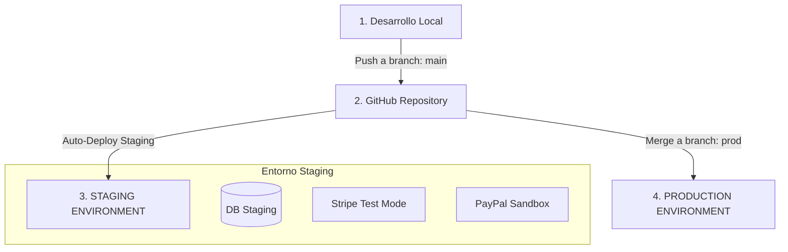

# 🚀 Guía de Configuración y Despliegue de Staging — Auron Suite

Esta guía te guiará paso a paso para configurar tu entorno de **Staging** (Pre-producción / Pruebas) de forma rápida y sin riesgo de afectar los datos reales de Producción.

---

## 🗺️ Visión General del Flujo



---

## 📋 Requisitos Previos

1. Una cuenta activa en **Render.com**.
2. Una cuenta en **cron-job.org** (gratuita para programar tareas).
3. Acceso a los Dashboards de **Stripe** (Test Mode) y **PayPal Developer** (Sandbox).

---

## 🛠️ Paso 1: Preparar las Ramas de Git

Para automatizar el despliegue separado, utilizaremos dos ramas en tu repositorio:
1. **`main`**: Será la rama para **Staging**. Cada vez que subas código a `main`, se actualizará Staging.
2. **`prod`**: Será la rama para **Producción**. Solo harás merge a esta rama cuando todo esté probado en Staging.

> [!TIP]
> Si deseas crear la rama `prod` a partir de tu estado actual, puedes ejecutar en tu terminal:
> ```bash
> git checkout -b prod
> git push origin prod
> git checkout main
> ```

---

## 🗄️ Paso 2: Crear la Base de Datos de Staging en Render

1. Entra al panel de **Render.com**.
2. Haz clic en **New +** ➔ **PostgreSQL**.
3. Configura los siguientes campos:
   * **Name**: `auron-suite-db-staging`
   * **Region**: *(La misma de tu servidor principal)*
   * **Database**: `auron_staging`
4. Haz clic en **Create Database**.
5. Una vez creada, copia el valor de **Internal Database URL** (la usaremos en el Paso 3).

---

## 🐍 Paso 3: Crear el Backend en Render (`auron-api-staging`)

Dado que el archivo `api_peluqueria/render.yaml` ya incluye la definición del servicio `auron-api-staging`, el proceso es sumamente sencillo:

1. En Render, haz clic en **New +** ➔ **Web Service**.
2. Conecta tu repositorio de GitHub.
3. Configura la información básica:
   * **Name**: `auron-api-staging`
   * **Root Directory**: `api_peluqueria`
   * **Runtime**: `Python`
   * **Build Command**: `./build.sh`
   * **Start Command**: `gunicorn backend.wsgi:application --bind 0.0.0.0:$PORT --workers 2 --threads 2 --worker-class gthread --timeout 120`
4. Despliega la sección **Environment Variables** y añade las siguientes variables críticas *(puedes guiarte de la plantilla que creamos en [api_peluqueria/.env.staging.example](file:///home/auron/Escritorio/proyects/api_peluqueria/.env.staging.example))*:

| Variable | Valor Sugerido | Descripción |
|---|---|---|
| `DJANGO_SETTINGS_MODULE` | `backend.settings` | Configuración base |
| `DEBUG` | `True` | Permite ver trazas de errores en Staging |
| `DATABASE_URL` | *(La URL de conexión interna del Paso 2)* | Base de datos de Staging |
| `SECRET_KEY` | *(Genera una clave aleatoria única)* | Clave de firma de Django |
| `JWT_SIGNING_KEY` | *(Genera otra clave aleatoria única)* | Clave para firmar tokens JWT |
| `ALLOWED_HOSTS` | `api-peluqueria-staging.onrender.com,localhost` | Dominios aceptados |
| `CORS_ALLOWED_ORIGINS` | `https://frontend-app-staging.onrender.com` | URL de tu Frontend de Staging |
| `CSRF_TRUSTED_ORIGINS` | `https://frontend-app-staging.onrender.com` | URL de tu Frontend de Staging |
| `STRIPE_SECRET_KEY` | `sk_test_...` | Llave **Test** de Stripe |
| `STRIPE_PUBLISHABLE_KEY`| `pk_test_...` | Llave **Test** de Stripe |
| `STRIPE_WEBHOOK_SECRET` | `whsec_...` | Se genera en el Paso 5 |
| `STRIPE_LIVE_MODE_CONFIRMED` | `False` | Forza el uso del sandbox de Stripe |
| `PAYPAL_CLIENT_ID` | *(De la app Sandbox en PayPal)* | ID de cliente Sandbox |
| `PAYPAL_SECRET` | *(De la app Sandbox en PayPal)* | Secreto Sandbox |
| `PAYPAL_SANDBOX` | `True` | Activa entorno Sandbox |
| `CELERY_TASK_ALWAYS_EAGER` | `True` | Ejecuta tareas asíncronas de inmediato |
| `CRON_API_KEY` | *(Genera una contraseña fuerte)* | Protege tus Cron Jobs en Staging |

---

## 🎨 Paso 4: Crear el Frontend en Render (`frontend-app-staging`)

1. En Render, haz clic en **New +** ➔ **Static Site**.
2. Conecta tu repositorio de GitHub.
3. Configura los siguientes campos:
   * **Name**: `frontend-app-staging`
   * **Root Directory**: `frontend-app`
   * **Branch**: `main`
   * **Build Command**: `npm run build -- --configuration=staging`
   * **Publish Directory**: `dist/auron-suite`
4. Añade las siguientes **Environment Variables** en Render para el frontend:

| Variable | Valor |
|---|---|
| `API_URL` | `https://auron-api-staging.onrender.com/api` |
| `WS_URL` | `wss://auron-api-staging.onrender.com/ws` |

---

## 💳 Paso 5: Configurar los Webhooks de Pruebas

Para que las suscripciones y los pagos de prueba funcionen de manera automática:

### Webhook de Stripe (Modo Test)
1. Ve a tu Dashboard de Stripe y activa el switch **Test Mode** (Modo de prueba).
2. Ve a **Developers** ➔ **Webhooks** ➔ **Add endpoint**.
3. Configura:
   * **Endpoint URL**: `https://auron-api-staging.onrender.com/api/subscriptions/stripe-webhook/`
   * **Events to listen**: Selecciona `customer.subscription.created`, `customer.subscription.updated`, `customer.subscription.deleted`, `invoice.payment_succeeded`, `invoice.payment_failed`.
4. Guarda el endpoint, copia la **Signing Secret** (`whsec_...`) y agrégala en la variable de entorno `STRIPE_WEBHOOK_SECRET` de tu backend de Staging en Render.

---

## ⏰ Paso 6: Configurar Cron Jobs para Staging

1. Regístrate o inicia sesión en **cron-job.org**.
2. Crea una nueva tarea (Cron Job) con esta configuración:
   * **URL**: `https://auron-api-staging.onrender.com/api/cron/run/?group=frequent`
   * **Execution**: Cada 15 minutos.
   * **Headers**: Agrega un Header personalizado:
     * Key: `X-Cron-Key`
     * Value: *(El valor que definiste en la variable `CRON_API_KEY` de Staging)*
3. Guarda el Cron Job. Esto simulará los envíos de correos de vencimiento de citas y trials en Staging de forma continua.

---

## 🧪 Paso 7: Verificar que Staging Funcione

1. Ingresa a la URL de tu Frontend de Staging: `https://frontend-app-staging.onrender.com`
2. Regístrate como un nuevo salón de belleza.
3. Realiza la compra de una suscripción usando una tarjeta de prueba de Stripe (p. ej., `4242 4242 4242 4242`).
4. Confirma que la suscripción se activa, que puedes crear citas de prueba, abrir la caja registradora, etc., sin tocar dinero real ni bases de datos de producción.
