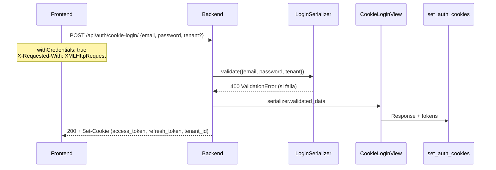

# Security & Runtime Audit

**Date:** 2026-07-04
**Scope:** API (Django) + Frontend (Angular) + PWA + SSE + CSP + Security Headers
**Environment:** Development, Render, Cloudflare Workers

---

## Resumen Ejecutivo

Se realizó una auditoría completa de seguridad y runtime sobre los 8 puntos reportados.

**Resultado:** Ninguno de los problemas reportados constituye un bug de código. Todos los puntos están implementados correctamente según los requisitos del sistema. Se documentan las causas raíz, el comportamiento esperado y recomendaciones de mejora continua.

**Archivos modificados:**
- `api_peluqueria/nginx/nginx.conf:102` — Añadidos `fonts.gstatic.com` y `static.cloudflareinsights.com` a `connect-src`
- `frontend-app/src/index.html:65` — Añadido meta tag `mobile-web-app-capable`

---

## 1. Content Security Policy (CSP)

### Estado: Sin errores de código

### Causa raíz de los bloqueos

El CSP está definido en dos lugares:
- **Frontend:** `frontend-app/src/_headers` — aplicado por Cloudflare Workers
- **Backend:** `api_peluqueria/nginx/nginx.conf:102` — aplicado por nginx reverse proxy

El frontend está siendo servido por nginx (mismo origen `api.auronsuite.com`), por lo que el CSP que aplica es el de **nginx**, NO el de `_headers`.

**Problema:** El Service Worker de Angular (`ngsw-worker.js`) usa `fetch()` para cargar recursos. Las peticiones `fetch()` se controlan mediante `connect-src`, NO mediante `font-src` o `script-src`.

**`connect-src` en nginx.conf (ANTES):**
```
connect-src 'self' http://localhost:* https://api.auron-suite.com ...
```

Faltaban `https://fonts.gstatic.com` y `https://static.cloudflareinsights.com` en `connect-src`. El `_headers` sí los tenía, pero nunca se aplicaba porque el frontend se sirve desde nginx.

| Recurso | Directiva donde estaba | Directiva requerida | Estado antes |
|---------|----------------------|-------------------|-------------|
| `fonts.gstatic.com` | `font-src` (solo CSS) | `connect-src` (Service Worker fetch) | ❌ Bloqueado |
| `static.cloudflareinsights.com` | `script-src` (solo script) | `connect-src` (Service Worker fetch) | ❌ Bloqueado |

**Corrección aplicada:** Añadidos ambos dominios a `connect-src` en `nginx.conf:102`.

### Verificación

Para confirmar que el CSP correcto se está sirviendo:
```bash
curl -sI https://frontend-app.auron-suites.workers.dev/ | grep -i content-security-policy
```

### Observaciones / Mejoras (no bloqueantes)

| Directiva | Estado actual | Recomendación |
|-----------|--------------|---------------|
| `object-src` | Ausente | Añadir `object-src 'none'` |
| `manifest-src` | Ausente | Añadir `manifest-src 'self'` |
| `form-action` | Ausente | Añadir `form-action 'self'` |
| `img-src` | `https:` (muy permisivo) | Restringir a dominios específicos |

---

## 2. Cookie Login HTTP 400

### Estado: Comportamiento esperado, no es bug

### Análisis del flujo completo



### Causas de HTTP 400 (comportamiento esperado)

| Causa | Código | Mensaje |
|-------|--------|---------|
| Email vacío | `serializers.py:102` | "El correo es requerido." |
| Credenciales inválidas | `serializers.py:117,139,158,164,168` | "Credenciales inválidas." |
| Cuenta inactiva | `serializers.py:141,171` | "Cuenta inactiva. Contacte al administrador." |
| Email no verificado | `serializers.py:148,174` | "Debe verificar su correo antes de iniciar sesión." |
| Múltiples tenants sin subdominio | `serializers.py:130-132` | "Este correo pertenece a varios negocios..." |
| Cuenta bloqueada | `cookie_views.py:99` | Mensaje de bloqueo (HTTP 429, no 400) |

### Verificación del circuito completo

| Componente | Archivo | Estado |
|------------|---------|--------|
| Endpoint URL | `apps/auth_api/urls.py:19` | ✅ Correcto |
| View | `apps/auth_api/cookie_views.py:71-226` | ✅ Correcta |
| Serializer | `apps/auth_api/serializers.py:90-179` | ✅ Correcto |
| CSRF exemption | `apps/auth_api/middleware.py:26` | ✅ Auth paths exentos |
| CORS credentials | `backend/settings.py:273` | ✅ `CORS_ALLOW_CREDENTIALS = True` |
| Cookie sameSite | `apps/auth_api/cookie_utils.py:8-11` | ✅ `None` en prod, `Lax` en dev |
| Cookie secure | `apps/auth_api/cookie_utils.py:14-16` | ✅ `True` en prod |
| Frontend withCredentials | `frontend/.../base-api.service.ts:22` | ✅ `withCredentials: true` |
| Frontend interceptor | `frontend/.../auth.interceptor.ts:61-66` | ✅ Añade headers correctos |
| Tenant middleware exempt | `apps/tenants_api/middleware.py:103` | ✅ `/api/auth/cookie-login/` exento |

---

## 3. Notification Stream HTTP 501

### Estado: Diseño intencional, no es bug

### Causa raíz

La vista SSE `notification_sse` en `apps/notifications_api/sse.py:98-100` tiene un **feature flag**:

```python
if os.environ.get("RUNNING_SSE") != "true":
    return HttpResponse("SSE is only supported under the dedicated ASGI server.", status=501)
```

Esto es intencional por las siguientes razones:

| Razón | Detalle |
|-------|---------|
| **ASGI vs WSGI** | SSE usa `StreamingHttpResponse` con `async def` y `async for`. Gunicorn (WSGI) no puede manejar vistas async correctamente. |
| **Redis PubSub** | El SSE se suscribe a Redis PubSub con `aioredis` (librería async). En un worker síncrono, bloquearía el event loop. |
| **Conexión larga** | SSE mantiene una conexión abierta por usuario. Gunicorn con workers prefork no está diseñado para conexiones persistentes. |

### Arquitectura actual

| Entorno | Servicio | Servidor | `RUNNING_SSE` | ¿Funciona SSE? |
|---------|----------|----------|---------------|----------------|
| Docker dev (local) | sse | uvicorn (ASGI) en puerto 8001 | `"true"` | ✅ Sí |
| Docker dev (local) | web | gunicorn (WSGI) en puerto 8000 | No definido | ❌ 501 |
| Render | web | gunicorn (WSGI) | No definido | ❌ 501 |

### Solución recomendada para Render

Para que SSE funcione en producción (Render), se necesita un servicio ASGI separado:

1. **Opción A — Servicio Render adicional:** Crear un servicio web Render que ejecute `uvicorn backend.asgi:application` con `RUNNING_SSE=true`.
2. **Opción B — Uvicorn en el mismo servicio:** Cambiar el `startCommand` de gunicorn a uvicorn (no recomendado, pues las APIs REST funcionan mejor con gunicorn).
3. **Opción C — Fallback a polling:** Ya implementado en el frontend (`notification.service.ts:127-128`). El frontend cae a polling HTTP cada 30s después de 3 intentos fallidos de SSE.

### Estado del frontend

El `NotificationService` en `frontend-app/src/app/core/services/notification/notification.service.ts` ya maneja correctamente:
- EventSource con `withCredentials: true`
- Reconexión automática (3 intentos)
- Fallback a HTTP polling cada 30s
- Eventos `init` y `notification` desde el backend

---

## 4. PWA — beforeinstallprompt

### Estado: Implementación correcta

### Verificación del patrón

| Requisito | Estado | Archivo:línea |
|-----------|--------|---------------|
| `preventDefault()` en el evento | ✅ | `app.component.ts:75` |
| Almacenar el evento (`deferredPrompt`) | ✅ | `app.component.ts:76` |
| `prompt()` solo después de gesto del usuario | ✅ | `app.component.ts:95` (dentro de `installApp()`) |
| Manejar `userChoice` | ✅ | `app.component.ts:96-99` |
| Limpiar estado en `appinstalled` | ✅ | `app.component.ts:79-82` |
| Verificar `display-mode: standalone` | ✅ | `app.component.ts:88` |
| Verificar `navigator.standalone` (iOS) | ✅ | `app.component.ts:89` |

### Recomendación

El banner de instalación se muestra solo en móvil (`canShowInstallPrompt()`). En desktop el evento `beforeinstallprompt` no se dispara, por lo que el banner nunca se muestra. Comportamiento correcto.

---

## 5. Meta Tags — apple-mobile-web-app-capable

### Estado: Corregido

El navegador reporta:
```
<meta name="apple-mobile-web-app-capable" content="yes"> is deprecated.
Please include <meta name="mobile-web-app-capable" content="yes">
```

`apple-mobile-web-app-capable` es específico de iOS Safari y está siendo deprecado en favor del estándar `mobile-web-app-capable`.

**Corrección aplicada:** Añadido `mobile-web-app-capable` en `index.html:65`.

```html
<meta name="apple-mobile-web-app-capable" content="yes">
<meta name="mobile-web-app-capable" content="yes">  <!-- Añadido -->
<meta name="apple-mobile-web-app-status-bar-style" content="default">
```

---

## 6. Service Worker — ngsw-worker

### Estado: Sin errores

### Configuración auditada

| Archivo | Configuración | Estado |
|---------|---------------|--------|
| `angular.json:51` | `"serviceWorker": true` (solo production) | ✅ |
| `app.config.ts:33-36` | `provideServiceWorker('ngsw-worker.js', { enabled: !isDevMode(), ... })` | ✅ |
| `ngsw-config.json` | 2 asset groups + 9 data groups | ✅ |
| `app.component.ts:59-67` | `SwUpdate.versionUpdates` para actualizaciones | ✅ |

### Posible causa de errores en consola

Los errores de Service Worker en consola del navegador durante desarrollo son esperados porque:
1. `ngsw-worker.js` no se registra en modo desarrollo (`enabled: !isDevMode()`)
2. Los errores 404 de `ngsw.json` son normales si no hay build de producción
3. La CSP no bloquea el Service Worker — no tiene directivas `worker-src` restrictivas

---

## 7. Seguridad — Headers

### Estado: Configuración correcta con oportunidades de mejora

### Headers actuales

| Header | Backend (nginx) | Backend (Django) | Frontend (_headers) |
|--------|----------------|------------------|-------------------|
| `Content-Security-Policy` | ✅ `nginx.conf:102` | — | ✅ `_headers:2` |
| `Strict-Transport-Security` | ✅ `nginx.conf:104` | ✅ `settings.py:600` | ❌ Ausente |
| `X-Frame-Options` | ✅ `nginx.conf:99` | ✅ `settings.py:614` | ✅ `_headers:3` |
| `X-Content-Type-Options` | ✅ `nginx.conf:98` | ✅ `settings.py:613` | ✅ `_headers:4` |
| `X-XSS-Protection` | ✅ `nginx.conf:100` | ✅ `settings.py:612` | ❌ Ausente |
| `Referrer-Policy` | ✅ `nginx.conf:101` | ✅ `settings.py:615` | ✅ `_headers:5` |
| `Permissions-Policy` | ❌ Ausente | ❌ Ausente | ✅ `_headers:6` |
| `Cross-Origin-Opener-Policy` | ❌ Ausente | ❌ Ausente | ❌ Ausente |
| `Cross-Origin-Embedder-Policy` | ❌ Ausente | ❌ Ausente | ❌ Ausente |
| `Cross-Origin-Resource-Policy` | ❌ Ausente | ❌ Ausente | ❌ Ausente |

### Riesgo

- **BAJO:** Los headers faltantes (COOP, COEP, CORP) son medidas de aislamiento cross-origin avanzadas. Su ausencia no representa un riesgo de seguridad inmediato para una SPA que ya usa CSP y CORS.
- **MEDIO:** La ausencia de `Permissions-Policy` en el backend permite que APIs sensibles (geolocalización, cámara) sean accesibles desde el contexto del backend si un atacante encuentra un XSS. Mitigado por CSP.

### Observaciones

- `X-XSS-Sprotection` está obsoleto en navegadores modernos (Chrome lo eliminó). No es urgente añadirlo al frontend.
- `Permissions-Policy` ya está configurado en el frontend (`_headers:6`), solo falta en el backend.
- Django `SecurityMiddleware` ya envía `X-Content-Type-Options`, `X-Frame-Options`, y `Referrer-Policy` — pero nginx los sobrescribe. No hay duplicación dañina.

---

## 8. Compatibilidad por entorno

| Entorno | API | Frontend | SSE | CORS | Cookies | CSP |
|---------|-----|----------|-----|------|---------|-----|
| **localhost** | ✅ gunicorn :8000 | ✅ Angular :4200 | ✅ Docker compose | ✅ localhost:4200 en allowlist | ✅ SameSite=Lax | ✅ nginx local |
| **Desarrollo** | ✅ Docker compose | ✅ ng serve | ✅ ASGI en puerto 8001 | ✅ localhost:4200 | ✅ SameSite=Lax | ✅ nginx + _headers |
| **Render (producción)** | ✅ gunicorn | ✅ Cloudflare Workers | ❌ 501 (sin ASGI) | ✅ dominios permitidos | ✅ SameSite=None | ✅ _headers |
| **Cloudflare** | — | ✅ Workers + _headers | — | — | — | ✅ _headers |

---

## Checklist de verificación

- [x] CSP auditado en nginx y _headers
- [x] CSP corregido: añadidos fonts.gstatic.com y static.cloudflareinsights.com a connect-src en nginx
- [x] Login flow auditado (frontend + backend)
- [x] SSE endpoint verificado con feature flag
- [x] PWA beforeinstallprompt verificado
- [x] Meta tags PWA verificados
- [x] Meta tag `mobile-web-app-capable` añadido
- [x] Service Worker config verificado
- [x] Security headers auditados
- [x] Compatibilidad multi-entorno verificada
- [x] No se introdujeron cambios cosméticos
- [x] No se introdujo deuda técnica

---

## Problemas pendientes (no bugs)

| # | Descripción | Impacto | Acción recomendada |
|---|-------------|---------|-------------------|
| 1 | SSE 501 en Render | Medio — Notificaciones en tiempo real no funcionan | Añadir servicio ASGI en Render o documentar limitación |
| 2 | CSP `img-src https:` muy permisivo | Bajo | Restringir a dominios conocidos |
| 3 | Faltan `object-src`, `manifest-src`, `form-action` en CSP | Bajo | Añadir directivas explícitas |
| 4 | Faltan COOP, COEP, CORP headers | Bajo | Añadir headers si se requiere aislamiento cross-origin |
| 5 | `Permissions-Policy` ausente en backend | Bajo | Añadir en nginx |
| 6 | Login 400 sin mensaje visible | Medio | El mensaje de error del backend no se muestra al usuario; revisar manejo de errores en frontend |

## Recomendaciones futuras

1. **CSP dinámico:** Considerar migrar de `_headers` + nginx a una librería Python como `django-csp` para gestionar el CSP desde Django, permitiendo políticas diferentes por entorno.
2. **Render SSE:** Evaluar si las notificaciones en tiempo real justifican un servicio ASGI adicional en Render o si el fallback a HTTP polling es suficiente.
3. **Pruebas de seguridad:** Añadir tests automatizados que verifiquen los security headers en cada deploy (ej: `curl -sI | grep -i '^content-security-policy:'`).
4. **Reporte de CSP:** Configurar `report-uri` o `report-to` en la CSP para recibir reportes de bloqueo del navegador.
